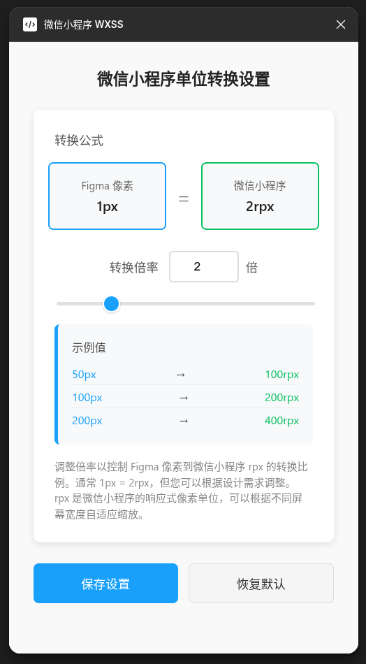
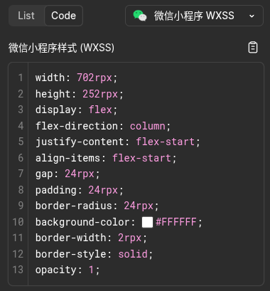

# 微信小程序 WXSS 单位转换插件

Figma 插件，用于将 Figma 设计元素转换为微信小程序（WeChat Mini Program）样式代码。

**Figma 社区插件地址**：[https://www.figma.com/community/plugin/1620454631553391223](https://www.figma.com/community/plugin/1620454631553391223)

## 功能特性

- **单位转换**：将 Figma 像素（px）转换为微信小程序响应式像素（rpx）
- **可配置倍率**：支持自定义转换倍率（默认 1px = 2rpx）
- **样式提取**：自动提取 Figma 节点的样式属性
- **布局转换**：将 Figma Auto Layout 属性转换为 CSS Flexbox
- **智能简写**：自动生成优化的 CSS 简写属性

### 截图展示

#### 设置界面 (UI)


#### 代码生成效果 (Code Generation)


### 支持的样式属性
- **布局属性**：宽度、高度、外边距、内边距
- **Flexbox 布局**：display、flex-direction、justify-content、align-items、gap
- **视觉属性**：圆角、背景色、边框、透明度
- **文本属性**：字体大小、粗细、家族、行高、字间距、对齐方式

## 安装使用

### 1. 在 Figma 中导入插件
1. 打开 Figma
2. 顶部菜单：**插件** > **开发** > **从清单导入插件...**
3. 选择项目中的 `manifest.json` 文件

### 2. 调整转换倍率
1. **右键点击** Figma 画布或设计元素
2. 选择 **插件** > **微信小程序 WXSS** > **设置转换倍率**
3. 在设置窗口中调整倍率值（默认 2，表示 1px = 2rpx）
4. 点击 **保存设置**

### 3. 生成微信小程序样式
1. 在 Figma 中选择任意设计元素
2. 切换到右侧 **Inspect 面板**
3. 在 **Code** 部分选择 **"微信小程序样式 (WXSS)"**
4. 复制生成的样式代码到微信小程序项目中

## 设置界面说明

设置界面提供直观的单位转换展示：

- **转换公式**：清晰展示 1px = Xrpx 的换算关系
- **倍率控制**：数字输入框 + 滑块，支持 0.1-10 范围
- **实时示例**：显示 50px、100px、200px 的转换结果
- **一键操作**：保存设置 / 恢复默认

## 开发说明

### 项目结构
```
├── code.ts              # 主插件逻辑
├── code.js              # 编译后的 JavaScript
├── ui.html              # 设置界面
├── manifest.json        # 插件配置
├── package.json         # 项目依赖
└── tsconfig.json        # TypeScript 配置
```

### 开发命令
```bash
npm run build    # 编译 TypeScript
npm run watch    # 监听文件变化并自动编译
npm run lint     # 代码检查
```

### 重新导入插件
修改代码后需要重新导入插件：
1. 运行 `npm run build`
2. 在 Figma 中重新导入 `manifest.json`

## 注意事项

- 插件支持两种运行模式：
  - **代码生成模式**：在 Inspect 面板自动运行
  - **设置界面模式**：通过插件菜单手动触发
- 转换倍率会保存在 Figma 客户端存储中
- 生成的代码为纯 CSS 样式声明，不包含类名或注释

## 技术支持

如有问题或建议，请参考项目文档或联系开发者。
